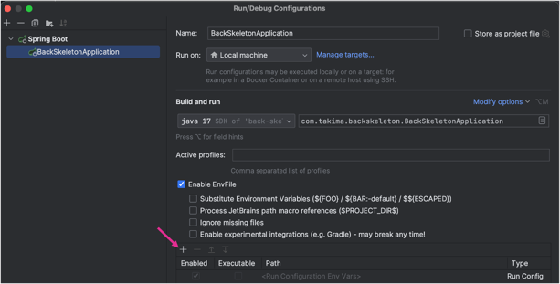
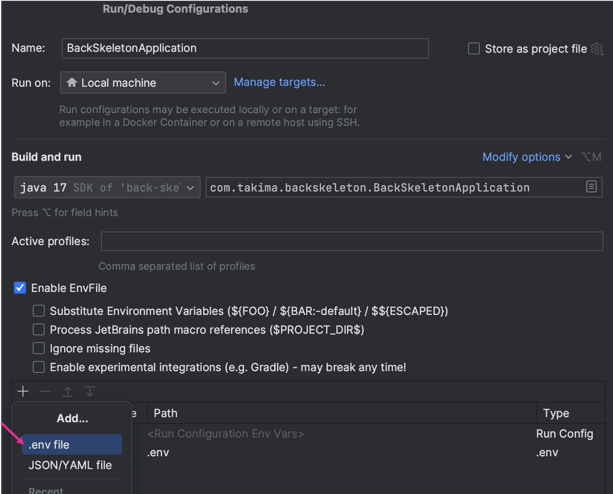
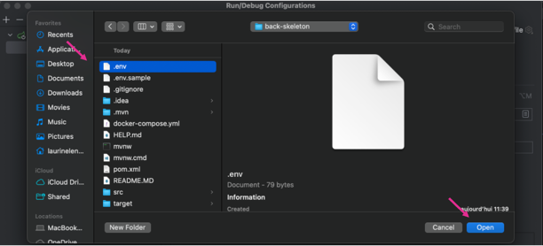

# Your backend API

## PostgreSQL et Swagger en local

Prerequis : Java 17 ou 21, Maven et Docker Desktop demarre.

1. Creer `.env` a partir de `.env.sample` et renseigner `DATABASE_NAME`, `DATABASE_USER` et `DATABASE_PASSWORD`.
2. Lancer `docker compose up -d`. Au premier demarrage sur un volume vide, PostgreSQL execute les scripts de `initdb/postgresql` pour creer les tables et les donnees de demonstration.
3. Verifier la base avec `docker compose ps` : le service doit etre `healthy`.
4. Lancer `mvn spring-boot:run`. Spring Boot charge automatiquement le `.env` depuis la racine du projet.
5. Ouvrir http://localhost:8080/swagger-ui.html et utiliser **Try it out**, puis **Execute**.

Les donnees PostgreSQL sont conservees dans le volume `postgres_data`. Les scripts MySQL historiques dans `initdb` ne sont pas executes par Docker.

## Set up 
1. Copie-colle le `.env.sample` en `.env`
2. Remplis le fichier `.env` avec les credentials de ton choix
3. Fait un `docker compose up`
4. Rajoute le plugin : [env-file](https://plugins.jetbrains.com/plugin/7861-envfile)
5. Ajoute ton fichier `.env` comme ci-dessous (n'oublie pas d'activer les fichiers cachés)

